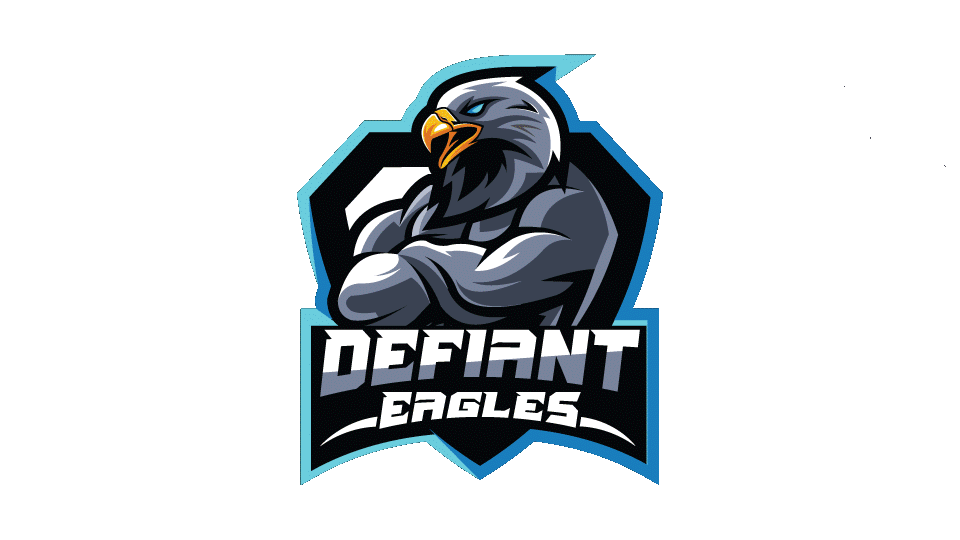

# 🦅 DEFIANT-EAGLE: Tactical Mini-Radar HUD Overlay for CS2

[](#)
[](#)
[](#)
[](#)

**Defiant-Eagle** is a premium, lightweight, and high-performance tactical mini-radar HUD overlay designed specifically for Counter-Strike 2. It reads player telemetry dynamically to render a beautiful, borderless radar overlay directly onto your screen, giving you real-time positional awareness during gameplay.

---

## 🌟 Key Features

*   **⚡ Ultra-Smooth Performance:** Powered by a thread-safe rendering engine operating at a stable **30 FPS** with **zero flickering**.
*   **🗺️ Intelligent Auto-Detection:** Automatically scans game state to detect and load the active map background in real time.
*   **🎨 Premium CS2 Styling:** Beautiful dark charcoal (`#0b0e11`) and gold (`#de9b35`) visual theme tailored to match CS2's main menu aesthetics.
*   **📐 Fully Customizable Layout:**
    *   **Size Slider:** Scale the radar canvas dynamically from **200px to 600px** to match your screen resolution.
    *   **Opacity Control:** Adjust transparency from **20% to 100%** for the perfect balance of visibility and focus.
    *   **Tactical Placement:** Snaps to the optimal left side of the screen by default. Includes a **Reset Position** button and supports drag-and-drop movement.
*   **🔒 Secure & Tamper-Proof:** Packaged using PyArmor obfuscation and compiled into a single, standalone executable—no Python installation required.

---

## 📸 Interface Preview

*Here you can upload screenshots of the HUD in action to your GitHub repository and link them below:*

```markdown
<!-- Replace this placeholder link with your actual screenshot link -->

```

---

## 🗺️ Supported Maps

Defiant-Eagle comes out of the box with highly accurate coordinate scaling for the most popular CS2 competitive maps:

| Map Name | Scaling Status | Mini-Map Background |
| :--- | :---: | :---: |
| 🏜️ `de_dust2` | Ready | Included |
| 🕌 `de_mirage` | Ready | Included |
| 🏛️ `de_inferno` | Ready | Included |
| 🏭 `de_nuke` | Ready | Included |
| 🎢 `de_overpass` | Ready | Included |
| 🏛️ `de_ancient` | Ready | Included |
| 🦂 `de_anubis` | Ready | Included |
| 🏗️ `de_vertigo` | Ready | Included |
| 🚂 `de_train` | Ready | Included |

---

## 🚀 Quick Start Guide

Using Defiant-Eagle is extremely straightforward. Since all resource files, maps, and libraries are pre-packaged into a single executable, you only need to run a single file:

1.  **Launch Counter-Strike 2.**
2.  **Open the application:** Double-click on `Defiant-Eagle.exe`.
3.  **Use the Overlay:**
    *   The borderless radar overlay will appear on the **left side** of your screen.
    *   The **Defiant-Eagle Controller** panel will open, allowing you to fine-tune your settings.
4.  **Customize:**
    *   Use the **Radar Size** slider to scale the overlay.
    *   Use the **Overlay Opacity** slider to adjust transparency.
    *   Click **Hide Overlay** to instantly toggle visibility.
    *   Click **Reset Position** to return the overlay to its default left-side position.
